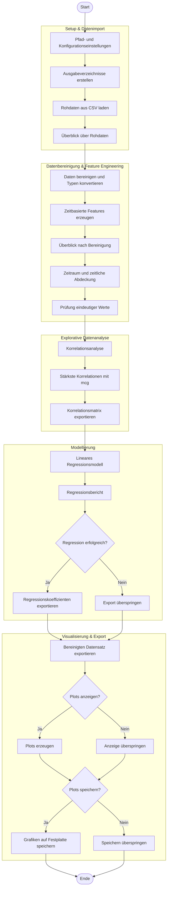

# QStudy Interdisciplinary Programming Applications

Dieses Projekt verarbeitet und analysiert Blitzeinschlagsdaten mit einem
End-to-End-Workflow: Datenimport, Bereinigung, Feature Engineering, Analyse,
Visualisierung und Export der Ergebnisse.

## Projektstruktur

```
.
├── documentation/
│   └── workflow_markdown.md   # Workflow-/Projektnotizen
├── resource/
│   ├── Info.txt               # Spaltenbeschreibung der Daten
│   └── lightning_strikes.csv  # Eingabedaten (muss manuell hinzugefügt werden)
└── src/
    ├── main.py                # Einstiegspunkt: gesamter Pipeline-Run
    ├── io_data.py             # Datenimport/-export
    ├── cleaning.py            # Datenbereinigung
    ├── analysis.py            # Analyse + lineare Regression
    ├── viz.py                 # Visualisierungen (Plots & Karten)
```

## Workflow / Pipeline

The following diagram illustrates the complete end-to-end data pipeline implemented in this project.
> Hinweis: Aufgrund der Größe des Workflows könnte das Diagramm im GitHub-Viewer standardmäßig minimiert dargestellt werden.  
> Über das Zoom-/Expand-Symbol lässt sich der vollständige Workflow anzeigen.



## Datenquelle

Die Pipeline erwartet eine CSV-Datei unter `resource/lightning_strikes.csv`. Die
Spaltenbeschreibung befindet sich in `resource/Info.txt`.

## Voraussetzungen

Python 3.10+ wird empfohlen. Benötigte Bibliotheken:

- pandas
- numpy
- scikit-learn
- matplotlib
- seaborn
- cartopy

Installationsbeispiel:

```
pip install pandas numpy scikit-learn matplotlib seaborn cartopy
```

## Ausführung

Vom Repository-Root:

```
python src/main.py
```

Der Standardlauf:

- lädt die CSV-Datei,
- bereinigt/standardisiert die Spalten,
- erzeugt Zeitfeatures,
- führt Korrelationen und eine lineare Regression durch,
- exportiert bereinigte Daten sowie Analyse-Ergebnisse,
- speichert Visualisierungen in `output/figures/` (konfigurierbar in `main.py`).

## Output

Beim Standardlauf werden u. a. erzeugt:

- `output/lightning_strikes_clean.csv`
- `output/correlation_matrix.csv`
- `output/regression_coefficients.csv`
- `output/figures/*.png`

